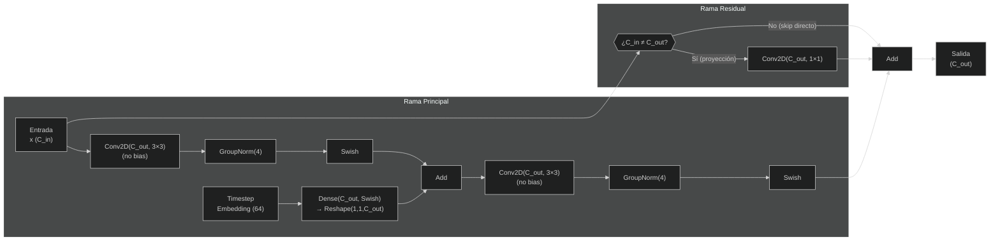
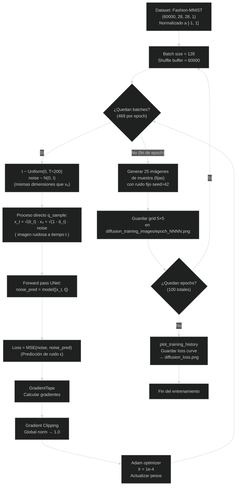
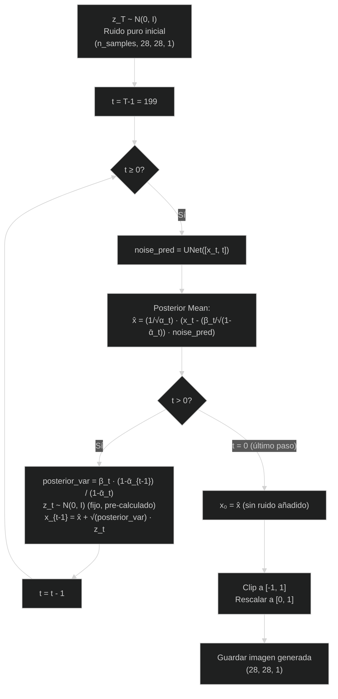

# Documentación - Modelo de Difusión (DDPM)

## Arquitectura del Modelo (U-Net con Conexiones Skip)

```mermaid
%%{init: {'theme': 'dark', 'themeVariables': { 'fontSize': '14px' }}}%%
graph LR
    subgraph Inputs["Entradas"]
        I1["Imagen ruidosa\nx_t\n(28, 28, 1)"]
        I2["Timestep\nt\n(scalar)"]
    end

    subgraph TimestepEmb["Timestep Embedding"]
        E1["Embedding(200→32)"]
        E2["Dense(32→64, Swish)"]
        I2 --> E1 --> E2
    end

    subgraph Encoder["Encoder (Downsampling)"]
        C0["Conv2D(16, 3×3, same)\n(28, 28, 16)"]
        RB1["ResidualBlock(16)\n+ Timestep Inject\n(28, 28, 16)"]
        DS1["Conv2D(32, 3×3, stride=2)\n(14, 14, 32)"]
        RB2["ResidualBlock(32)\n+ Timestep Inject\n(14, 14, 32)"]
        DS2["Conv2D(64, 3×3, stride=2)\n(7, 7, 64)"]

        I1 --> C0 --> RB1 --> DS1 --> RB2 --> DS2
    end

    subgraph Bottleneck["Bottleneck"]
        RB3["ResidualBlock(64)\n+ Timestep Inject\n(7, 7, 64)"]
        DS2 --> RB3
    end

    subgraph Decoder["Decoder (Upsampling)"]
        UP1["UpSampling2D(2×)\n+ Conv2D(32, 3×3)\n(14, 14, 32)"]
        CAT1["Concatenate\n(14, 14, 64)"]
        RB4["ResidualBlock(32)\n+ Timestep Inject\n(14, 14, 32)"]
        UP2["UpSampling2D(2×)\n+ Conv2D(16, 3×3)\n(28, 28, 16)"]
        CAT2["Concatenate\n(28, 28, 32)"]
        RB5["ResidualBlock(16)\n+ Timestep Inject\n(28, 28, 16)"]

        RB3 --> UP1 --> CAT1 --> RB4 --> UP2 --> CAT2 --> RB5
    end

    subgraph SkipConns["Conexiones Skip"]
        RB1 -.->|"skip1 (28, 28, 16)"| CAT2
        RB2 -.->|"skip2 (14, 14, 32)"| CAT1
    end

    subgraph OutputHead["Salida"]
        GN["GroupNorm(4)"]
        SW["Swish Activation"]
        CO["Conv2D(1, 3×3, same)\nkernel= zeros\n(28, 28, 1)"]
        O1["Ruido predicho\nε_θ(x_t, t)\n(28, 28, 1)"]

        RB5 --> GN --> SW --> CO --> O1
    end

    E2 -->|"+ (adición)"| RB1
    E2 -->|"+ (adición)"| RB2
    E2 -->|"+ (adición)"| RB3
    E2 -->|"+ (adición)"| RB4
    E2 -->|"+ (adición)"| RB5
```

### Detalle de un ResidualBlock

---

## Flujo de Entrenamiento

---

## Flujo de Muestreo (Inferencia / Reverse Process)

---

## Parámetros Clave

| Parámetro | Valor |
|---|---|
| Timesteps (T) | 200 |
| Beta schedule | Lineal, 1e-4 → 0.02 |
| Batch size | 128 |
| Learning rate | 1e-4 (Adam) |
| Gradient clipping | Global norm 1.0 |
| Epochs | 100 |
| Loss | MSE (ε-prediction, peso uniforme) |
| Dataset | Fashion-MNIST (60K imágenes, 28×28×1) |
| Muestra | 25 imágenes (grid 5×5) por epoch |
